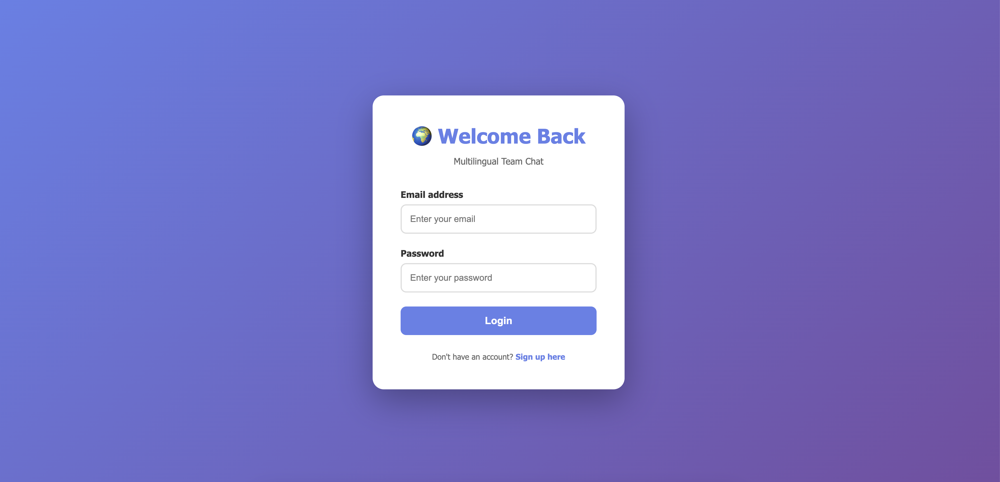

# BridgeMango 🥭
Built to help global teams communicate naturally across languages without losing meaning in translation.

Translate messages between 10+ languages while preserving cultural context and idioms — because "I'm in a pickle" shouldn't become "Estoy en un pepinillo" 🥒

⚠️ Work in Progress: This application is currently under active development. Features and functionality are being continuously improved and expanded.

<!-- ---

## ✨ Features

- 🔄 **AI-Powered Translation** — Real-time message translation with cultural context awareness
- 🎭 **Idiom Adaptation** — Idioms are culturally adapted, not literally translated
- 💾 **Persistent Storage** — MongoDB stores all team messages and conversation history
- 🌐 **Languages** — Currently supports English, Spanish, French, German, Chinese, Japanese, Portuguese, Italian, Dutch, Polish, Russian, Korean and Turkish
- 🎨 **Modern UI** — Clean, responsive interface built with EJS templating
- 🔌 **RESTful API** — Complete API endpoints for frontend/backend separation
- ⏰ **Timestamp Tracking** — Every message automatically timestamped
- 🔄 **Auto-Refresh** — Messages refresh every 30 seconds to stay updated
- 📱 **Mobile Responsive** — Works seamlessly on desktop, tablet, and mobile
- 🎤 Voice message translation — Integrates Deepgram for audio transcription
- 💬 Text translation — Integrates DeepL for text translation
- 🔔 Notifications — Real-time browser notifications for new messages
- 🔐 End-to-end encryption — Secure message encryption

## 🧩 Tech Stack

| Tech | Description |
|------|--------------|
| 🟢 **Node.js + Express** | Server-side runtime and web framework |
| 💾 **MongoDB + Mongoose** | NoSQL database for storing messages and data |
| 🤖 **AI Integration Ready** | Handles user authentication with local strategy |
| 🎨 **EJS Templates** | Dynamic server-side rendering of pages |
| 🔐 **CORS** | Cross-Origin Resource Sharing enabled |
| 📦 **dotenv** | Environment variable management for security | 

**Bootstrap or Tailwind CSS coming soon*

---

## ⚙️ Installation

1. Clone repo
2. run `npm install`

## Usage

1. run `npm run dev`
2. Navigate to `localhost:3000`

---

## 📸 Screenshot

  

---

## 💡 Future Enhancements

- 🔌 WebSocket integration — Real-time chat with Socket.io
- 👥 User authentication — Add user accounts and team management
- 📱 Mobile App — Build React Native version
- 😮 Message reactions — Add emoji reactions and possibly threading
- 🔍 Search functionality — Search through message history
- 📊 Analytics dashboard — Track translation usage and statistics
- 🤝 Team collaboration — Multiple team rooms and channels

## 🎨 Credits
- Inspiration — The need for better multilingual team collaboration --> 