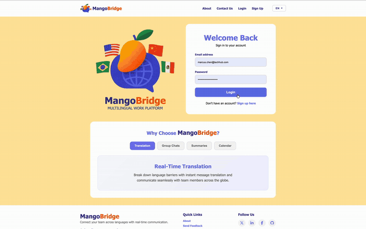

# MangoBridge - Multilingual Workplace Platform

**Klaviyo AI Builder Residency Application**

> "If you talk to a man in a language he understands, that goes to his head. If you talk to him in his language, that goes to his heart."
> Nelson Mandela

**Video URL:** TBD

**Live App: **[https://mangobridge.onrender.com/](https://mangobridge.onrender.com/)**

---

## Problem Statement

Language is the single biggest invisible barrier in the global workplace, and it costs companies far more than they realize.

A 2025 report by DeepL found that **70% of U.S. enterprises with global operations face language barriers on a daily basis**. These are not minor inconveniences. They lead to measurably reduced productivity, reduced participation in meetings and decisions, and reduced creativity among teams. When people cannot express themselves fully, ideas die in translation. 

The affected audience is broad: multinational companies, remote-first teams, immigrant-led communities, healthcare workers serving ESL populations, and NGOs operating across borders. The current solution for many teams is a patchwork of copy-pasting into translation tools, relying on bilingual colleagues to bridge gaps, or accepting miscommunication as the cost of doing business globally.

**Success looks like:** a team of 10 people across 4 countries being able to hold a group chat, run a meeting, and review notes with translation built into the workflow. The outcome is measured in time saved, participation from non-native speakers, and reduction in miscommunication-related errors.

---

## Solution Overview

MangoBridge is a full-stack AI-powered multilingual workplace platform that removes language as a barrier to collaboration. It provides:

- **AI-assisted message translation** across 13+ languages in direct and group chat, powered by DeepL.
- **Meeting transcription and summaries** using Deepgram for speech-to-text, summarization, topics, intents, and sentiment.
- **Transcript translation** so meeting follow-up can be reviewed across languages.
- **Integrated calendar tools** for planning events and tracking tasks.
- **Secure multi-user authentication** with profile management, per-user archive state, and group read tracking.

AI is not supplementary here. The AI layer is what makes participation more equitable: a team member can write or speak in one language and create translated collaboration artifacts for the rest of the team.

---

## AI Integration

| Component | Technology | Implementation |
|---|---|---|
| Message translation | DeepL API | Messages are translated before they are saved and displayed in chat. |
| Meeting transcription | Deepgram | Users record audio in the app, then Deepgram generates a punctuated transcript. |
| Meeting summaries | Deepgram AI | The app sends transcript text to Deepgram's read API for summaries, sentiment, topics, and intents. |
| Transcript translation | DeepL API | Meeting transcripts can be translated for multilingual follow-up. |

**Tradeoffs considered:**

- **DeepL vs. generic translation APIs:** DeepL was chosen for natural business-language output and broad language coverage.
- **Deepgram vs. local transcription:** Deepgram avoided local model setup and supports both transcription and post-meeting AI analysis through hosted APIs.
- **Server-rendered UI:** EJS kept the MVP compact and made it easier to focus on the collaboration workflows instead of frontend build tooling.

**Where AI exceeded expectations:** Deepgram's summarization output was useful with minimal prompting, especially for turning raw transcripts into readable follow-up notes.

**Where AI fell short:** Automated translation can still flatten highly contextual phrases. A future improvement would be a review or flagging workflow for sensitive, ambiguous, or low-confidence translations.

---

## Architecture / Design Decisions

```text
Browser (EJS templates)
        |
        v
Express.js server (Node.js)
        |
   +----+----+
   |         |
MongoDB   External APIs
(Mongoose) + DeepL (translation)
           + Deepgram (transcription and summarization)
           + Cloudinary widget path for profile images
```

**Key decisions:**

- **Server-rendered EJS over a React SPA:** Given the scope of the MVP and the need to ship quickly, EJS templates reduced complexity.
- **MongoDB:** Flexible schema works well for users, groups, messages, calendar events, and per-user archive state.
- **Express Session with Passport.js:** This is a standard authentication pattern for a server-rendered MVP.
- **Per-user read and archive tracking:** Messages can be unread or archived for one user while remaining visible to others.
- **Translation before save:** Chat routes call the translation service while handling message creation, then store the original text, translated text, and a basic AI note.

**Third-party libraries and APIs used:**

- [DeepL API](https://www.deepl.com/en/pro-api) - Translation
- [Deepgram](https://deepgram.com/) - Speech-to-text and summarization
- [Cloudinary](https://cloudinary.com/) - Profile image widget support
- [Passport.js](http://www.passportjs.org/) - Authentication
- [bcryptjs](https://www.npmjs.com/package/bcryptjs) - Password hashing
- [Multer](https://www.npmjs.com/package/multer) - File upload handling

---

## What AI Helped With

**Where it accelerated development:**

I used Claude Code throughout the build. The biggest time savings were in boilerplate: setting up Passport.js authentication flows, wiring upload handling, and scaffolding MongoDB schemas. AI was also useful for debugging asynchronous API integration issues around transcription, translation, and route responses.

**Where it got in the way:**

AI tools sometimes generated code that assumed different library versions or a simpler data model. The most useful pattern was to prompt in smaller pieces, validate the output quickly, and then adjust the implementation to match MangoBridge's actual per-user archive and group-message behavior.

---

## Getting Started / Setup Instructions

```bash
git clone https://github.com/angy255/MangoBridge.git
cd MangoBridge
npm install
```

Create a local `.env` file in the project root:

```env
MONGODB_URI=your_mongodb_connection_string
SESSION_SECRET=your_session_secret
DEEPL_API_KEY=your_deepl_api_key
DEEPGRAM_API_KEY=your_deepgram_api_key

# Optional, used by the profile image upload widget
CLOUD_NAME=your_cloudinary_cloud_name

# Recommended for production deployments
NODE_ENV=production
```

Run the development server:

```bash
npm run dev
```

Navigate to `http://localhost:3000`.

For production, use Node 18+ with:

```bash
npm install
npm start
```

---

## Demo

**Core flows to demo:**

1. **Sign up / log in** - Create an account and profile.
2. **Group chat and translation** - Create a group, add members, send a message, and review the translated result.
3. **Meeting workflow** - Record audio in the meeting tab, generate a transcript, translate it, and create an AI summary for follow-up.
4. **Calendar** - Create an event, mark it complete, and review the day taskbar.



---

## Testing / Error Handling

**Error handling implemented:**

- DeepL and Deepgram API failures are caught and returned as user-facing route errors.
- Meeting transcription validates that audio was provided and that a transcript was generated.
- Session-protected routes redirect unauthenticated users to login.
- Multer enforces file type and size limits on uploaded audio and profile images.

**Edge cases considered:**

- Archive state is per-user, so deleting or archiving a message for yourself does not remove it for other group members.
- Two-stage deletion helps prevent accidental permanent message loss.
- Meeting transcripts can be edited before translation or summary generation.

**What I would add with more time:** A Jest and Supertest suite for route coverage, plus integration tests for multi-user chat, group unread counts, message archiving, and meeting transcription flows.

---

## Future Improvements / Stretch Goals

- **Mobile app** - The use case is strong on mobile because people are often in meetings or on the go.
- **Video calls with live caption translation** - Extend meetings with real-time multilingual captions.
- **Message reactions and threading** - Add richer conversation primitives.
- **Search** - Search through message history, summaries, and calendar events.
- **Analytics dashboard** - Track translation usage, top languages, and message volume per team.
- **Slack, Teams, and Zoom integrations** - Bring MangoBridge's translation layer to tools teams already use.
- **Translation review workflow** - Flag sensitive or ambiguous translations for human review.

---

## Acknowledgments

- [DeepL](https://www.deepl.com) - Professional-grade translation API
- [Deepgram](https://deepgram.com) - Speech-to-text and AI summarization
- Inspired by the daily reality of multilingual communities and by Nelson Mandela's belief that language is the path to someone's heart.
