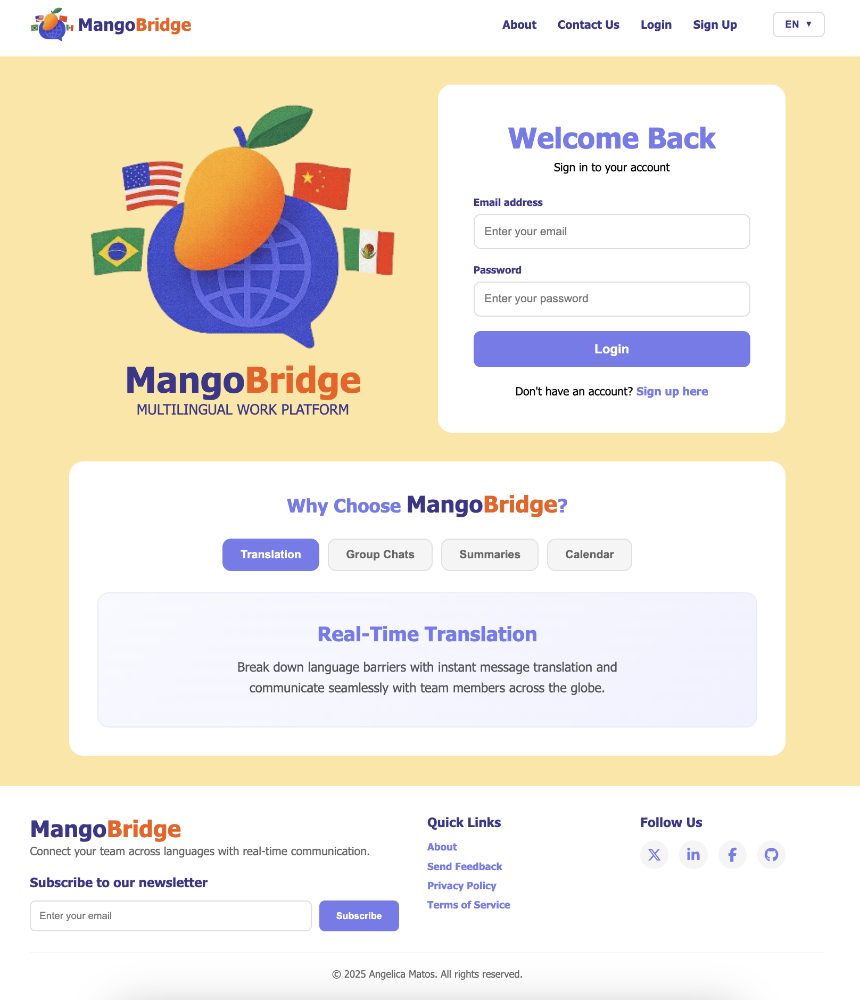

# 🥭 MangoBridge - Multilingual Work Platform
Breaking down language barriers in the workplace with AI-powered real-time translation and intelligent collaboration tools.

Translate messages between 13+ languages while preserving cultural context and idioms — because "I'm in a pickle" shouldn't become "Estoy en un pepinillo" 🥒

⚠️ Work in Progress: This application is currently under active development. Features and functionality are being continuously improved and expanded.

## ✨ Features

### 🔄 Real-Time Translation
- **AI-Powered Translation** — Instant message translation powered by DeepL with cultural context awareness
- **13+ Languages** — English, Spanish, French, German, Chinese, Japanese, Portuguese, Italian, Dutch, Polish, Russian, Korean, Turkish
- **Translation Preview** — See translations before sending messages

### 💬 Group Collaboration
- **Multi-User Group Chats** — Create groups, manage members, and organize conversations
- **Per-User Read Tracking** — Independent read states for each group member
- **Real-Time Unread Badges** — Dynamic notification system across all groups
- **Member Management** — Add/remove members with role-based permissions

### 🎙️ Meeting Tools
- **Audio Transcription** — Record meetings with Deepgram's speech-to-text
- **AI Summaries** — Automatic meeting summary generation with sentiment analysis
- **Editable Transcripts** — Review and modify transcriptions before saving
- **Translation Integration** — Translate meeting transcripts between languages

### 📅 Integrated Calendar
- **Event Management** — Create, edit, and delete calendar events with time/location
- **Visual Calendar Grid** — Month view with color-coded event indicators
- **Task Completion Tracking** — Mark events as complete with visual feedback
- **Day Taskbar** — Side panel showing all events for selected day

### 🔐 User Profiles & Security
- **Secure Authentication** — Passport.js with bcrypt password hashing
- **Cloudinary Integration** — Profile picture uploads with image optimization
- **Custom Avatars** — Support for URL avatars or initials fallback
- **Location & Bio Fields** — Customizable user profiles

### 📱 Archive & Organization
- **Message Archives** — Per-user message archiving with two-stage deletion
- **Thread Management** — Archive entire conversation threads
- **Selective Visibility** — Messages archived for one user remain visible to others

---

## 🧩 Tech Stack

| Tech | Description |
|------|--------------|
| **Node.js + Express** | Server-side runtime and REST API framework |
| **MongoDB + Mongoose** | NoSQL database for schema modeling |
| **DeepL API** | Professional-grade translation (13 languages) |
| **Deepgram** | Speech-to-text transcription and AI summarization |
| **Passport.js** | User authentication (Local Strategy) |
| **bcrypt** | Password hashing and security |
| **Cloudinary** | Cloud image hosting and optimization |
| **EJS Templates** | Server-side templating engine |
| **Multer** | Multipart file upload handling |
| **Express Session** | Stateful user sessions | 

**Bootstrap or Tailwind CSS coming soon*

---
<!-- 
## 🏗️ Architecture
```
MangoBridge/
├── config/
│   ├── cloudinary.js       # Cloudinary configuration
│   └── passport.js          # Passport authentication strategies
├── middleware/
│   └── auth.js              # Authentication middleware
├── models/
│   ├── CalendarEvent.js     # Calendar event schema
│   ├── ChatGroup.js         # Group chat schema with members
│   ├── Meeting.js           # Meeting data schema
│   ├── MeetingSummary.js    # Meeting summary schema
│   ├── Message.js           # Message schema with Maps for tracking
│   └── User.js              # User schema with bcrypt
├── public/
│   ├── css/                 # Modular CSS files
│   ├── js/                  # Client-side JavaScript
│   └── images2/             # Static assets
├── routes/
│   ├── auth.js              # Login, signup, profile routes
│   ├── calendar.js          # Calendar CRUD operations
│   ├── chatGroups.js        # Group chat management
│   ├── meetings.js          # Meeting recording/transcription
│   ├── messages.js          # Message CRUD with archiving
│   └── users.js             # User listing for group creation
├── services/
│   ├── summarizationService.js  # Deepgram text summarization
│   ├── transcriptionService.js  # Deepgram audio transcription
│   └── translationService.js    # DeepL translation API
├── views/
│   ├── partials/            # EJS reusable components
│   ├── index.ejs            # Main app interface
│   ├── login.ejs            # Login page
│   ├── signup.ejs           # Registration page
│   ├── profile.ejs          # User profile page
│   └── landing.ejs          # Marketing landing page
├── server.js                # Express server entry point
└── package.json             # Dependencies
``` 
--- -->

## ⚙️ Installation

1. Clone repo
2. run `npm install`

## Usage

1. run `npm run dev`
2. Navigate to `localhost:3000`

---

## 📸 Screenshot

<p align="center">
  
</p>

---

## 💡 Future Enhancements

- 👥 Video Calls — Integrated video conferencing
- 📱 Mobile App — Build React Native version
- 😮 Message reactions — Add emoji reactions and possibly threading
- 🔍 Search functionality — Search through message history
- 📊 Analytics dashboard — Track translation usage and statistics
- 🤝 Integration APIs — Slack, Teams, Zoom webhooks

## 🎨 Credits
- Inspiration — The need for better multilingual team collaboration 
